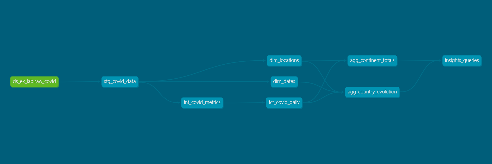

# Pipeline Dados Covid

## Explicação Breve do Projeto
Pipeline de dados ETL orquestrado com Airflow, utilizando dbt para transformações e Google Cloud (Cloud Storage e BigQuery) para armazenamento. Os dados brutos no formato `.csv` são extraídos de um repositório e carregados em um bucket do GCP via função Python. No BigQuery, o dbt realiza a limpeza, transformação e modelagem dos dados para consumo analítico.

## Decisões Técnicas
* **Modularidade no dbt:** Divisão lógica em camadas: *Staging* (limpeza), *Intermediate* (cálculos) e *Marts* (modelagem).
* **Chaves Artificiais (Surrogate Keys):** Uso da função `FARM_FINGERPRINT` para gerar chaves únicas de localidade (`location_key`) e padronização da chave de data (`date_key`) em formato inteiro `YYYYMMDD`.
* **Tratamento de Exceções:** Utilização de `SAFE_DIVIDE` no cálculo de métricas (casos/mortes por 100 mil habitantes) para evitar erros de divisão por zero em populações inconsistentes.
* **Garantia de Qualidade:** Testes de dados genéricos do dbt (`not_null` e `unique`) implementados nas chaves primárias e colunas essenciais para assegurar a integridade.

## Arquitetura - Star Schema
A modelagem adotada segue os princípios de um esquema estrela (Star Schema), com objetivo de trabalhar a separação de tabelas por contexto.
A tabela fato central `fct_covid_daily` armazena os eventos diários (casos, mortes, população). Essa tabela se conecta diretamente às tabelas de dimensão (`dim_locations` e `dim_dates`) por meio de chaves estrangeiras (`location_key` e `date_key`).

## Comunicação das Tabelas (Linhagem de Dados)



## Análises Geradas
A partir das tabelas agregadas, foram desenvolvidas consultas SQL para responder a perguntas sobre a pandemia:

* **Países com mais casos:** Identifica o Top 10 países com o maior volume de casos acumulados.
```sql
-- 1. Quais países tiveram mais casos?

SELECT 
    country AS Country,
    SUM(cases) AS Total_Cases_Accumulated
FROM `laboratorio-489120`.`ds_ex_lab_delivery`.`agg_country_evolution`
GROUP BY Country
ORDER BY Total_Cases_Accumulated DESC
LIMIT 10;
```

Os Estados Unidos lideram isolados o ranking global em volume (mais de 9,4 milhões de casos), seguidos por Índia (8,3 milhões) e Brasil (5,5 milhões).

* **Relação População x Casos:** Analisa o impacto demográfico calculando a taxa de casos a cada 100 mil habitantes por país.
```sql
-- 2. Existe relação entre população e número de casos?

SELECT 
    country AS Country,
    MAX(population) AS Population,
    SUM(cases) AS Total_Cases,
    ROUND(SAFE_DIVIDE(SUM(cases), MAX(population)) * 100000, 2) AS Cases_per_100k_Inhabitants
FROM `laboratorio-489120`.`ds_ex_lab_delivery`.`agg_country_evolution`
GROUP BY Country
ORDER BY Population DESC;
```
O tamanho da população não determina o volume de contágio de forma proporcional. A China, país mais populoso, registrou uma incidência extremamente baixa (6,38 casos por 100 mil habitantes). Em contraste, Estados Unidos e Brasil combinam grandes populações com altíssimas taxas de contágio (ambos acima de 2.600 casos por 100 mil habitantes).

* **Continente mais afetado:** Identifica quais os continentes mais afetados.
```sql
-- 3. Qual continente foi mais afetado?

SELECT 
    continent AS Continent,
    SUM(total_cases) AS Total_Cases,
    SUM(total_deaths) AS Total_Deaths,
    ROUND(AVG(continent_cases_per_100k), 2) AS Avg_Cases_per_100k
FROM `laboratorio-489120`.`ds_ex_lab_delivery`.`agg_continent_totals`
GROUP BY Continent
ORDER BY Total_Cases DESC;
```
O continente americano (América) consolidou-se como o epicentro da pandemia, liderando em todas as métricas analisadas: maior volume total de casos (21 milhões), maior número absoluto de mortes (651 mil) e maior incidência média (7,23 casos a cada 100 mil habitantes).

* **Taxa de letalidade (Top 10):** Com base nos 10 países mais afetados em número de casos, calcula o percentual de letalidade (mortes/casos) específico desse grupo.
```sql
-- 4. Qual dos 10 países mais afetados apresentou a menor taxa de letalidade (morte)?

WITH top_affected_countries AS (
    SELECT
        country AS Country,
        SUM(cases) AS Total_Cases,
        SUM(deaths) AS Total_Deaths
    FROM `laboratorio-489120`.`ds_ex_lab_delivery`.`agg_country_evolution`
    GROUP BY Country
    ORDER BY Total_Cases DESC
    LIMIT 10
)

SELECT 
    Country,
    Total_Cases,
    Total_Deaths,
    ROUND(SAFE_DIVIDE(Total_Deaths, Total_Cases) * 100, 2) AS Lethality_Rate_Percentage
FROM top_affected_countries
ORDER BY Lethality_Rate_Percentage ASC;
```

Existe uma disparidade na mortalidade, mesmo entre países com maior volume de contágio. A Índia registrou a menor taxa do grupo (1,49%), enquanto o México apresentou uma letalidade atípica e extrema (9,88%), evidenciando, talvez, uma saturação da infraestrutura de saúde local.
